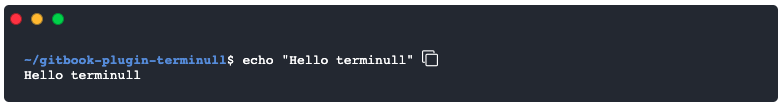

<div align="center">
 <h1> Terminull </h1>
 Terminull is a gitbook plugin allows you to create a modern terminal for your gitbook pages in order to documente your commands and it gives you a fast way to copy the command .
  <br>
  <br>
	<a href="https://www.npmjs.com/package/gitbook-plugin-terminull"></a>
  <br>
  <br>
</div>


## How to use it?
To use Terminull plugin in your Gitbook project, add the terminull plugin to the `book.json` file of your project, then install plugins using `gitbook install`.

```json
{
    "plugins": ["terminull"]
}
```

## Create you terminal

First, you need to create a terminal. Each terminal should have a directory where command is excuted, command and output of the command.

```


~/gitbook-plugin-terminull

echo "Hello terminull"

Hello terminull

```
## You like my work :exclamation:
In case you were wondering how you can thanks me for my work, coffee :coffee: is the way to my heart. 
<style>.bmc-button img{width: 35px !important;margin-bottom: 1px !important;box-shadow: none !important;border: none !important;vertical-align: middle !important;}.bmc-button{padding: 7px 10px 7px 10px !important;line-height: 35px !important;height:51px !important;min-width:217px !important;text-decoration: none !important;display:inline-flex !important;color:#FFFFFF !important;background-color:#FF813F !important;border-radius: 5px !important;border: 1px solid transparent !important;padding: 7px 10px 7px 10px !important;font-size: 28px !important;letter-spacing:0.6px !important;box-shadow: 0px 1px 2px rgba(190, 190, 190, 0.5) !important;-webkit-box-shadow: 0px 1px 2px 2px rgba(190, 190, 190, 0.5) !important;margin: 0 auto !important;font-family:'Cookie', cursive !important;-webkit-box-sizing: border-box !important;box-sizing: border-box !important;-o-transition: 0.3s all linear !important;-webkit-transition: 0.3s all linear !important;-moz-transition: 0.3s all linear !important;-ms-transition: 0.3s all linear !important;transition: 0.3s all linear !important;}.bmc-button:hover, .bmc-button:active, .bmc-button:focus {-webkit-box-shadow: 0px 1px 2px 2px rgba(190, 190, 190, 0.5) !important;text-decoration: none !important;box-shadow: 0px 1px 2px 2px rgba(190, 190, 190, 0.5) !important;opacity: 0.85 !important;color:#FFFFFF !important;}</style><link href="https://fonts.googleapis.com/css?family=Cookie" rel="stylesheet"><a class="bmc-button" target="_blank" href="https://www.buymeacoffee.com/ridaeh"><span style="margin-left:15px;font-size:28px !important;">Buy me a coffee</span></a>


## Contributing
Bug reports and pull requests are welcome.